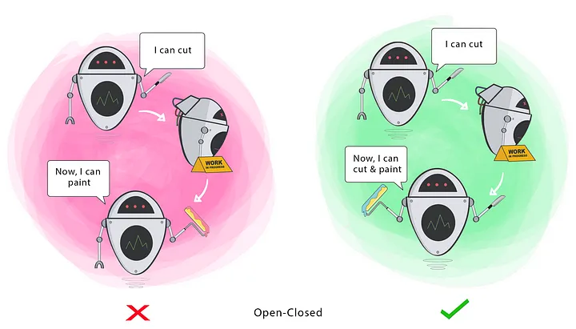

# Open/Closed Principle

Changing the current behaviour of a Class will affect all the systems using that Class.

If you want the Class to perform more functions, the ideal approach is to **add to the functions that already exist, NOT change them.**

